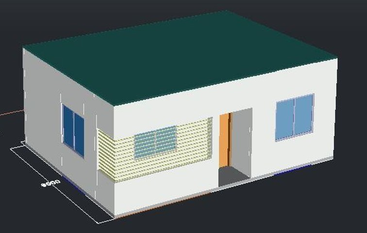
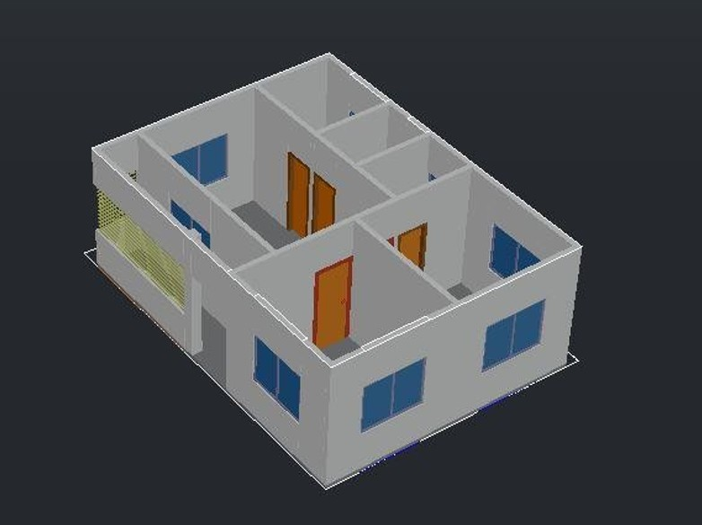
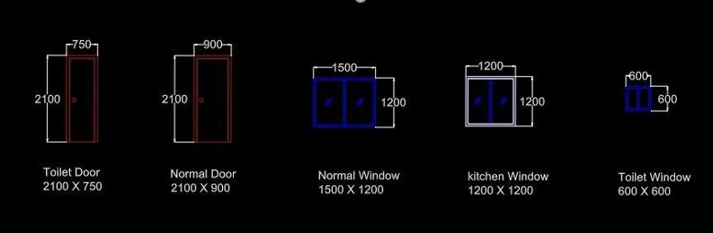
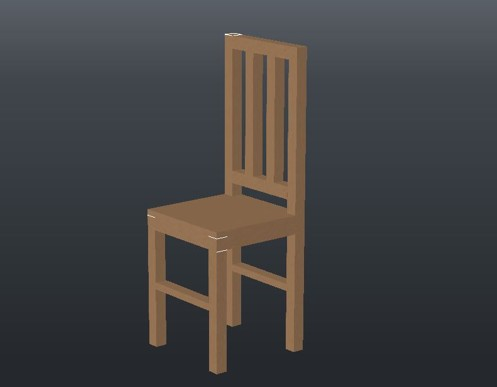
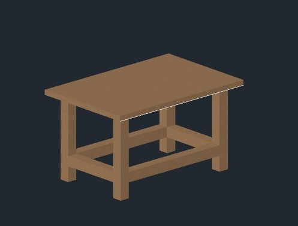

# AutoCAD Design Project: Real-Life Objects & Architecture

## Project Overview
This repository showcases the final term project for the **Computer-Aided Engineering Drawing (CSE200)** course at **East West University**. The project involves designing detailed 2D drafts and 3D models of furniture and a residential building using **AutoCAD**.

---

## Academic Details

|  Title |  Details |
| :--- | :--- |
| **University** | East West University |
| **Department** | Computer Science and Engineering (CSE) |
| **Course Code** | CSE200 |
| **Course Title** | Computer-Aided Engineering Drawing |
| **Instructor** | Jesan Ahammed Ovi (Senior Lecturer) |
| **Submission Date** | August 6, 2024 |

---

## Project Gallery

Here are the rendered views of the 3D models and 2D plans designed in this project.

### Architectural Design (House Project)

| **3D Full House** | **3D View (Without Roof)** |
| :---: | :---: |
|  |  |
| *Exterior view of the residential building* | *Interior layout view identifying rooms* |

 

| **Floor Plan** | **Door & Window Details** |
| :---: | :---: |
|  |  |
| *2D Drafting of the Floor Plan* | *Detailed dimensions of doors/windows* |

---

### Furniture Design

| **Wooden Chair** | **Wooden Table** |
| :---: | :---: |
|  |  |
| *3D Model of a standard wooden chair* | *3D Model of a utility table* |

---

## Repository Structure

* **`pictures/`** - Contains all rendered images (JPG format).
* **`.dwg` files** - Original AutoCAD source files (`chair.auto.dwg`, `house.auto.dwg`, etc.).
* **`Project Report(200).pdf`** - Official project documentation and specifications.

## 👨‍💻 Submitted By

**Md Arman Hossain** Department of CSE, East West University

---
